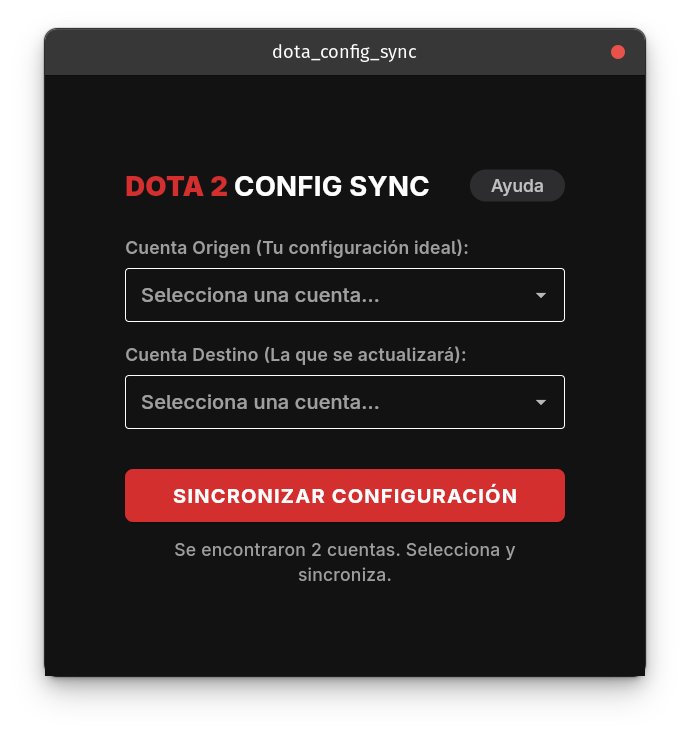
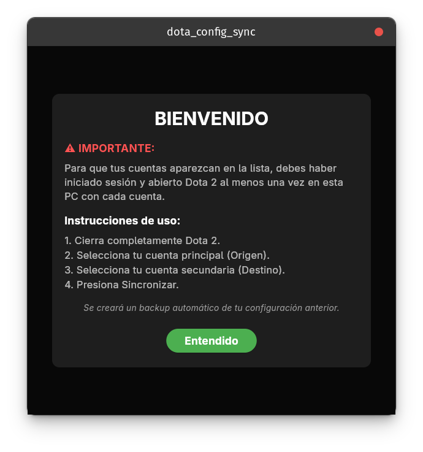

# Dota 2 Config Sync


Aplicación gráfica moderna, rápida y multiplataforma diseñada para sincronizar de manera automática las configuraciones locales (teclas, macros, video, opciones) y el archivo `userdata` entre múltiples cuentas de Dota 2 en una misma PC.

---

## Características Principales

* **Sincronización a un clic:** Copia la configuración de tu cuenta principal a tus cuentas secundarias (smurfs) sin tener que lidiar con los archivos del sistema manualmente.
* **Detección Automática:** Encuentra automáticamente las carpetas de Steam y los IDs de usuario instalados en tu sistema.
* **Interfaz Intuitiva:** Diseñada para ser fácil de usar y directa al grano.
* **Ultra Rápida:** Construida con Flutter y compilada a código nativo para un rendimiento óptimo.

---

## Capturas de Pantalla


*Pantalla principal de selección de cuentas.*


*Pantalla de ayuda.*

---

## Instalación y Descargas

La aplicación está disponible precompilada para Windows y múltiples distribuciones de Linux en la sección de [Releases](../../releases/latest).

### Arch Linux / Manjaro / EndeavourOS (Recomendado)
El programa está publicado oficialmente en el Arch User Repository (AUR). Puedes instalarlo en segundos utilizando tu ayudante favorito (como `yay` o `paru`):

```bash
yay -S dota-config-sync-bin